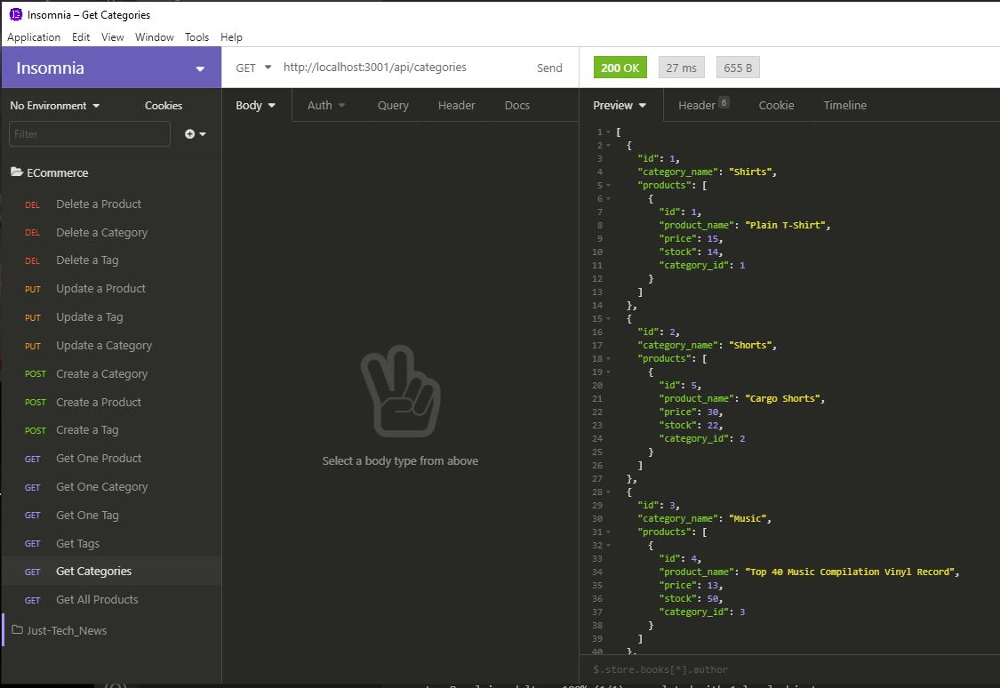

# E-commerce Site Back End 

Richard Ay, October 2020 *(Updated August 2022)*

## Table of Contents
* [Project Objective](#project-objective)
* [Acceptance Criteria](#acceptance-criteria)
* [Technologies Used](#technologies-used)
* [ECommerce Logic](#ecommerce-logic)
* [Application Screen Shot](#application-screen-shot)

## Project Objective
AS A manager at an Internet Retail company, I WANT a back end for my e-commerce website that uses the latest technologies
so that my company can compete with other e-commerce companies.

## Acceptance Criteria
GIVEN a functional Express.js API,

1) When I add my database name, MySQL username, and MySQL password to an environment variable file, then I am able to connect to a database using Sequelize.

2) When I enter schema and seed commands, then a development database is created and is seeded with test data.

3) When I enter the command to invoke the application, then my server is started and the Sequelize models are synced to the MySQL database.

4) When I open API GET routes in Insomnia Core for categories, products, or tags, then the data for each of these routes is displayed in a formatted JSON.

5) When I test API POST, PUT, and DELETE routes in Insomnia Core, then I am able to successfully create, update, and delete data in my database.

## Technologies Used
* The NPM package express.
* The NPM package mysql2.
* The NPM package sequelize.
* The NPM package dotenv.
* Insomnia (for route testing)

## ECommerce Logic

There is no front-end for this application.  This is just a back-end that can be exercised in "Insomnia".

The models (for tags, products, productTags and categories) are setup in the \models directory.  The associations between these models (and their corresponding tables) are defined in the index.js file in this same directory.

The routes for these models/tables are setup in the \routes directory.  These routes control the data flow to the actual database.

The database is setup using the schema in \db and seeded from \seeds.

Videos showing data modification of the database tables (using Insomnia) can be found in the \Videos folder.  There are four videos shown the various phases of operation:
* Database setup via the schema and seeding. (Log into MySQL, )
* The 'get' and 'create' operations (routes).
* The 'update' operations (routes).
* The 'delete' operations (routes).

## Application Screen Shot
